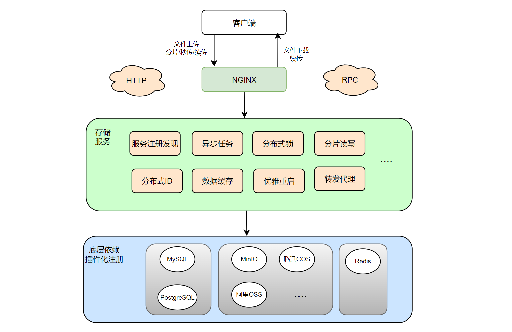
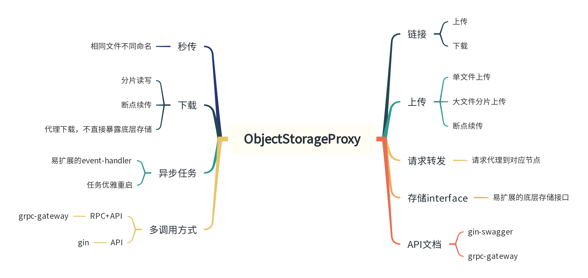
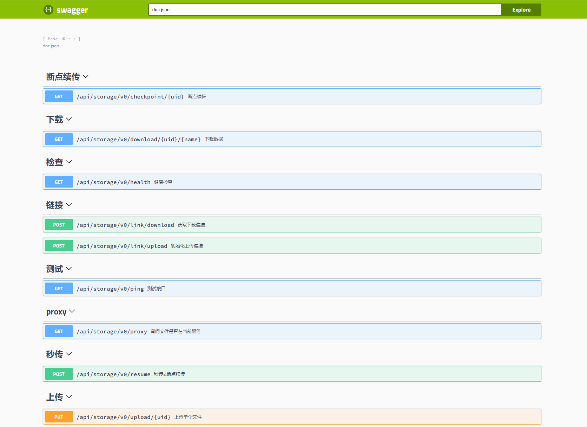

## osproxy

`osproxy`是一个使用Go语言开发的对象存储分布式代理(object-storage-distributed-proxy)，可以作为文件存储微服务，包括但不限于以下功能：

* 分布式uid及秒传，支持相同文件不同命名
* 分片读写，大文件上传，merge接口不用等待数据合并，分片上传完直接下载
* 异步任务，易扩展的event-handler，支持分片合并及其他文件处理任务
* 统一封装，降低业务接入复杂度，业务侧只需要存储文件uid
* 代理下载，不直接暴露底层存储厂商及格式
* 支持集群部署，proxy模块处理不同机器的分片转发
* 支持Local/MinIO/腾讯COS/阿里OSS等对象存储，易于扩展
* 支持Docker一键部署


本项目仅用作学习交流，如果你正在学习Go语言，并且该项目给你的学习带来了一些帮助，欢迎star，欢迎交流。


## 目录

| [架构](#架构) | [功能](#功能) | [API](#API文档) | [技术栈](#技术栈) | [更新日志](#更新日志) | [本地](#本地调试) | [单机](#单机部署) | [集群](#集群部署) | [扩展](#扩展存储) | [如何接入](#如何接入osproxy) |  [庖丁解牛](#庖丁解牛) | [grpc实现](#grpc实现) |[讨论群](#讨论群) |
|:---------:|:---------:|:-------------:|:-----------:|:-------------:|:-----------:|:-----------:|:-----------:|:-----------:|:-------------:|:-----------------:|:-----------------:|:-----------------:|

## 架构



## 功能



## API文档

[在线体验API文档](http://124.222.198.8/swagger/index.html#/)



## 技术栈


* Golang
* Gin
* GORM
* Redis
* MySQL/PostgreSQL
* MinIO
* Swagger
* Zap
* Nginx
* Docker

## 更新日志
- [X] 新增本地存储

## 本地调试
**注意： 请提前准备好golang和docker环境；服务启动会自动创建表，但不会创建库，需要自己创建库.**


**注意：本地调试，不使用nginx做反向代理.**
### 基础服务
* 启动pg数据库

```shell
docker run -d --restart=always -p 5432:5432 --name=postgresql -v `pwd`/pg:/var/lib/postgresql/data -e POSTGRES_PASSWORD=123456 postgres
```

* 启动redis

```shell
docker run -d --restart=always --name myredis -p 6379:6379 redis --requirepass "123456"
```

* 启动minio

```shell
# 9000是api端口，9090是控制台端口
docker run -p 9000:9000 -p 9001:9001 --name minio -d --restart=always -e "MINIO_ACCESS_KEY=minioadmin" -e "MINIO_SECRET_KEY=minioadmin" -v `pwd`/minio/data:/data -v `pwd`/minio/config:/root/.minio minio/minio server /data --console-address ":9001"
```
### 配置修改
* 修改配置文件

```shell
app:
  env: prod
  port: 8888                # 服务端口
  app_name: osproxy         # 服务名称
  app_url: http://127.0.0.1

log:
  level: info               # 日志等级
  root_dir: ./storage/logs  # 日志根目录
  filename: app.log         # 日志文件名称
  format: json              # 写入格式 可选json
  show_line: true           # 是否显示调用行
  max_backups: 3            # 旧文件的最大个数
  max_size: 500             # 日志文件最大大小（MB）
  max_age: 28               # 旧文件的最大保留天数
  compress: true            # 是否压缩
  enable_file: false        # 是否启用日志文件

database:
  - db_name: default
    driver: postgres                # 数据库驱动
    host: 127.0.0.1                 # 服务地址
    port: 5432                      # 端口号
    database: postgres              # 数据库名称
    username: postgres              # 用户名
    password: 123456                # 密码
    charset: utf8mb4                # 编码格式
    max_idle_conns: 10              # 空闲连接池中连接的最大数量
    max_open_conns: 100             # 打开数据库连接的最大数量
    log_mode: info                  # 日志级别
    enable_lg_log: false            # 是否开启自定义日志
    enable_file_log_writer: false   # 是否打印到日志文件
    log_filename: sql.log           # 日志文件名称

redis:
  host: 127.0.0.1        # 服务地址
  port: 6379             # 服务端口
  db: 0                  # 库选择
  password: 123456       # 密码

minio:
  endpoint: 127.0.0.1:9000      # 服务地址
  access_key_id: minioadmin     # 用户名
  secret_access_key: minioadmin # 密码
  use_ssl: false                # 密码
  enabled: true                 # 是否启用

cos:
  appid: 12***63195                              # 唯一标识
  region: ap-nanjing                             # 地域
  secret_id: AKIDc4GCrG*******p9GApIZdU9V        # 用户名
  secret_key: IMDoC1uYw*******1pNTRFpBJOJzSm     # 密码
  enabled: false                                 # 是否启用

oss:
  endpoint: oss-cn-beijing.aliyuncs.com          # 服务地址
  access_key_id: LTAI5t*******X1tHK              # 用户名
  access_key_secret: bfCt*******HudARdfwfvaoS    # 密码
  enabled: false                                 # 是否启用
  
local:
  enabled: false                                 # 是否启用
```

### 服务启动

```shell
# 设置goproxy
Linux: go env -w GOPROXY=https://goproxy.cn,direct
Windows: $env:GOPROXY = "https://goproxy.cn"

# 拉取依赖
go mod tidy
go install github.com/swaggo/swag/cmd/swag@v1.8.1

# 修改本地变量

app/pkg/utils/constant.go
LocalStore变量, 更新成本地可访问的目录


# 生成api文档
swag fmt -g cmd/main.go -d ./
swag init -g cmd/main.go
http://127.0.0.1:8888/swagger/index.html#/
```

### 服务测试
* 服务部署验证
  ```shell
  # 修改服务地址和上传文件
  baseUrl := "http://127.0.0.1:8888"
  uploadFilePath := "./xxx.jpg"
  # 启动服务
  go run cmd/main.go
  # 测试
  go run test/httptest.go
  ```
* 下载断点续传测试
  ```shell
  wget -c url
  ```

### 本地构建镜像

```shell
# 这里使用dockerhub作为镜像仓库，请提前创建好账户密码

# 登录，username和passwd替换成有效的账户密码
echo passwd | docker login --username=username --password-stdin

# 本地构建，version替换成自定义的有效字符，比如v0.1
docker build -t osproxy:version -f Dockerfile  .

# 镜像重命名，qinguoyi/object-storage-proxy请替换成你的username/repo
docker tag osproxy:version qinguoyi/object-storage-proxy:version

# 镜像上传
docker push qinguoyi/object-storage-proxy:tag
```

## 单机部署


**注意：单机部署，使用nginx做反向代理；安装docker compose**

### 配置修改
* http
  * [docker-compose.yaml](deploy/http/docker-compose.yaml)
  * [nginx.conf](deploy/http/nginx.conf)
* https
  * [docker-compose.yaml](deploy/https/docker-compose.yaml)
  * [nginx.conf](deploy/https/nginx.conf)
  * 自签名证书，只需要pem和key后缀的文件即可
    * [如何本地实现自签名证书](https://learnku.com/articles/73105)

* 修改config.yaml
  * 使用的是compose，config中的各服务的host，指向的是compose service的名字，比如db，redis等

* 机器路径下创建必需文件
  ```shell
  [root@k8s-node1 rpc]# ls
  conf  docker-compose.yml  nginx.conf  server.key  server.pem
  # conf是目录，conf/config.yaml
  ```


### 启动服务
```shell
docker compose up -d
```

### 服务测试
* 服务部署验证
  ```shell
  # 修改服务地址和上传文件
  baseUrl := "https://124.222.198.8"
  uploadFilePath := "./xxx.jpg"
  
  go run test/httptest.go
  ```
* 下载断点续传测试
  ```shell
  wget -c url
  ```

### 停止服务

```shell
docker compose down
```

## 集群部署

* 如果是docker-swarm或者k8s部署，注意修改获取local ip的方法，直接使用`GetClientIp`即可，集群内可以互通；
* 如果是腾讯云或者阿里云的服务器，直接部署，服务器间是不能互通内网ip的，需要使用`GetOutBoundIP`获取外网ip。

```golang
// GetClientIp 获取本地网卡ip
func GetClientIp() (string, error) {
	addrs, err := net.InterfaceAddrs()

	if err != nil {
		return "", err
	}

	for _, address := range addrs {
		// 检查ip地址判断是否回环地址
		if ipnet, ok := address.(*net.IPNet); ok && !ipnet.IP.IsLoopback() {
			if ipnet.IP.To4() != nil {
				return ipnet.IP.String(), nil
			}

		}
	}

	return "", errors.New("can not find the client ip address")
}

// GetOutBoundIP 获取外网ip
func GetOutBoundIP() (string, error) {
	//向查询IP的网站发送GET请求
	resp, err := http.Get("http://myexternalip.com/raw")
	if err != nil {
		panic(err)
	}
	defer resp.Body.Close()

	//读取响应的内容
	body, err := ioutil.ReadAll(resp.Body)
	if err != nil {
		panic(err)
	}
	return string(body), nil
}
```

### 服务测试

* 服务部署验证
  ```shell
  # 修改服务地址和上传文件
  baseUrl := "https://124.222.198.8"
  uploadFilePath := "./xxx.jpg"
  
  go run test/httptest.go
  ```
* 下载断点续传测试
  ```shell
  wget -c url
  ```


## 扩展存储

* 实现CustomStorage接口并注册，用于存取数据

```go
// CustomStorage 存储
type CustomStorage interface {
	// MakeBucket 创建存储桶
    MakeBucket(string) error

    // GetObject 获取存储对象
    GetObject(string, string, int64, int64) ([]byte, error)

    // PutObject 上传存储对象
    PutObject(string, string, string, string) error
}

// InitStorage 注册启动顺序
func InitStorage(conf *config.Configuration) {
    var storageHandler CustomStorage
    if conf.Minio.Enabled {
        storageHandler = NewMinIOStorage()
        bootstrap.NewLogger().Logger.Info("当前使用的对象存储：Minio")
    } else if conf.Cos.Enabled {
        storageHandler = NewCosStorage()
        bootstrap.NewLogger().Logger.Info("当前使用的对象存储：COS")
    } else if conf.Oss.Enabled {
        storageHandler = NewOssStorage()
        bootstrap.NewLogger().Logger.Info("当前使用的对象存储：OSS")
    } else {
        panic("当前对象存储都未启用")
    }

    lgStorage = &LangGoStorage{
        Mux:     &sync.RWMutex{},
        Storage: storageHandler,
    }
    for _, bucket := range []string{"image", "video", "audio", "archive", "unknown", "doc"} {
        if err := storageHandler.MakeBucket(bucket); err != nil {
            panic(err)
        }
    }
}
```

* 实现Plugin接口，用于初始化和健康检查

```golang
// Plugin 插件接口
type Plugin interface {
    // Flag 是否启动
    Flag() bool
    // Name 插件名称
    Name() string
    // New 初始化插件资源
    New() interface{}
    // Health 插件健康检查
    Health()
    // Close 释放插件资源
    Close()
}
```

* 增加config.yaml配置项

```shell
# 类似下面的存储
minio:
  endpoint: 127.0.0.1:9000      # 服务地址
  access_key_id: minioadmin     # 用户名
  secret_access_key: minioadmin # 密码
  use_ssl: false                # 密码
  enabled: true                 # 是否启用

cos:
  appid: 12***63195                              # 唯一标识
  region: ap-nanjing                             # 地域
  secret_id: AKIDc4GCrG*******p9GApIZdU9V        # 用户名
  secret_key: IMDoC1uYw*******1pNTRFpBJOJzSm     # 密码
  enabled: false                                 # 是否启用

oss:
  endpoint: oss-cn-beijing.aliyuncs.com          # 服务地址
  access_key_id: LTAI5t*******X1tHK              # 用户名
  access_key_secret: bfCt*******HudARdfwfvaoS    # 密码
  enabled: false  

local:
  enabled: false                                 # 是否启用
```
## 如何接入osproxy
**客户端对接存储代理服务，业务侧仅存储文件uid.**
* 上传
  * 客户端对接存储代理，判断秒传/断点续传，获取上传链接后上传数据到存储，返回文件uid，上报到业务侧
  ```mermaid
  sequenceDiagram
  Note left of 客户端(web/api):上传接入osproxy
  客户端(web/api) ->>+ osproxy: 请求秒传
  alt 数据已上传
  osproxy-->>-客户端(web/api) : 文件uid
  客户端(web/api) ->>+ 业务侧: 文件uid
  业务侧-->>- 客户端(web/api) : 上报成功
  else 数据不存在
  osproxy-->>+客户端(web/api) : 文件不存在
  客户端(web/api) ->>+ osproxy: 请求上传链接
  osproxy-->>-客户端(web/api) : 文件链接及上传uid
  客户端(web/api) ->>+ osproxy: 上传数据
  osproxy-->>-客户端(web/api) : 成功，返回文件uid
  客户端(web/api) ->>+ 业务侧: 文件uid
  业务侧-->>- 客户端(web/api) : 上报成功
  end
  ```
* 下载
  * 客户端从业务侧获取文件uid，从存储代理获取下载链接，返回文件数据。
  ```mermaid
  sequenceDiagram
  Note left of 客户端(web/api):下载接入osproxy
  客户端(web/api) ->>+ 业务侧: 获取业务侧文件
  业务侧-->>- 客户端(web/api) : 文件uid
  客户端(web/api) ->>+ osproxy: 文件uid
  osproxy-->>-客户端(web/api) : 加密下载链接
  ```
## 庖丁解牛

敬请期待...

## grpc实现


[grpc+ssl](https://github.com/qinguoyi/osproxy-grpc)

## 讨论群
* 微信群失效，加我微信，备注osproxy

|    微信群    |     作者微信      |
|:---------:|:-------------:|
|  | |


## License


Distributed under the Apache 2.0 License. See LICENSE for more information.
